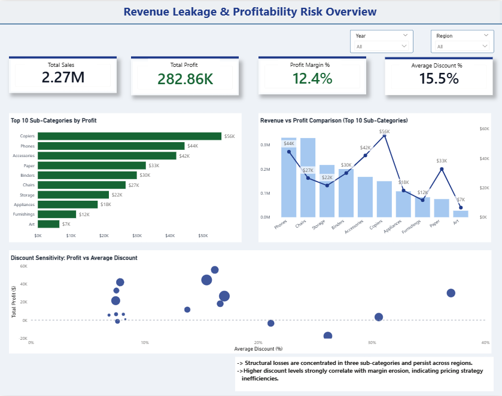

📊 Retail Profitability & Revenue Leakage Analysis
🔎 Problem Statement

Retail businesses often generate strong revenue but still struggle with profitability due to pricing inefficiencies and structural losses across product segments.

This project investigates:

Why certain sub-categories are consistently loss-making

Whether revenue translates effectively into profit

The impact of discount strategy on margin erosion

Whether losses are regional or structural

🛠 Tools & Technologies Used
MySQL

Data cleaning and validation

Profit aggregation logic

Loss identification

Discount analysis

Power BI

Data modeling

DAX measure creation

Dynamic loss-segment filtering

Executive-level dashboard design

DAX

Profit Margin calculations

Aggregation-aware loss flag logic

Context-sensitive filtering

📂 Dataset

Superstore Retail Dataset
Contains ~10,000 retail transactions including:

Sales, Profit, Quantity, Discount

Product hierarchy (Category & Sub-Category)

Regional segmentation

Order-level time data

Dataset Source:
https://www.kaggle.com/datasets/vivek468/superstore-dataset-final?resource=download

📊 Analytical Approach

The project was structured into two analytical layers:

1️⃣ Executive Overview

Profit concentration analysis

Revenue vs Profit comparison

Discount sensitivity scatter analysis

2️⃣ Diagnostic Deep Dive

Sub-category profitability across regions

Structural loss detection

Dynamic filtering of loss-making segments

Discount behavior comparison

📈 Key Insights

Profitability is concentrated in a limited number of sub-categories.

Three sub-categories demonstrate structural losses across regions.

High revenue does not necessarily translate into high margins.

Elevated discount levels correlate strongly with profit erosion.

Loss patterns indicate structural pricing inefficiencies rather than isolated regional issues.

📷 Dashboard Preview

Executive Overview

Diagnostic Page

📁 Repository Structure

/sql → Data cleaning & analytical SQL queries

/powerbi → Power BI dashboard file

/screenshots → Dashboard previews

🎯 Business Implication

The analysis highlights opportunities for discount optimization and margin improvement within structurally loss-making segments.
